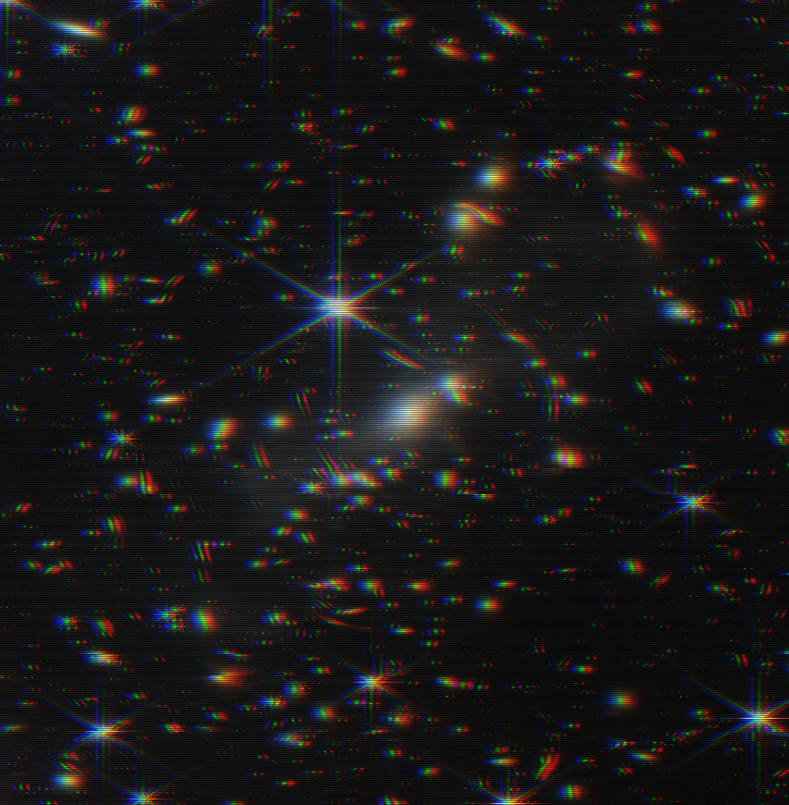
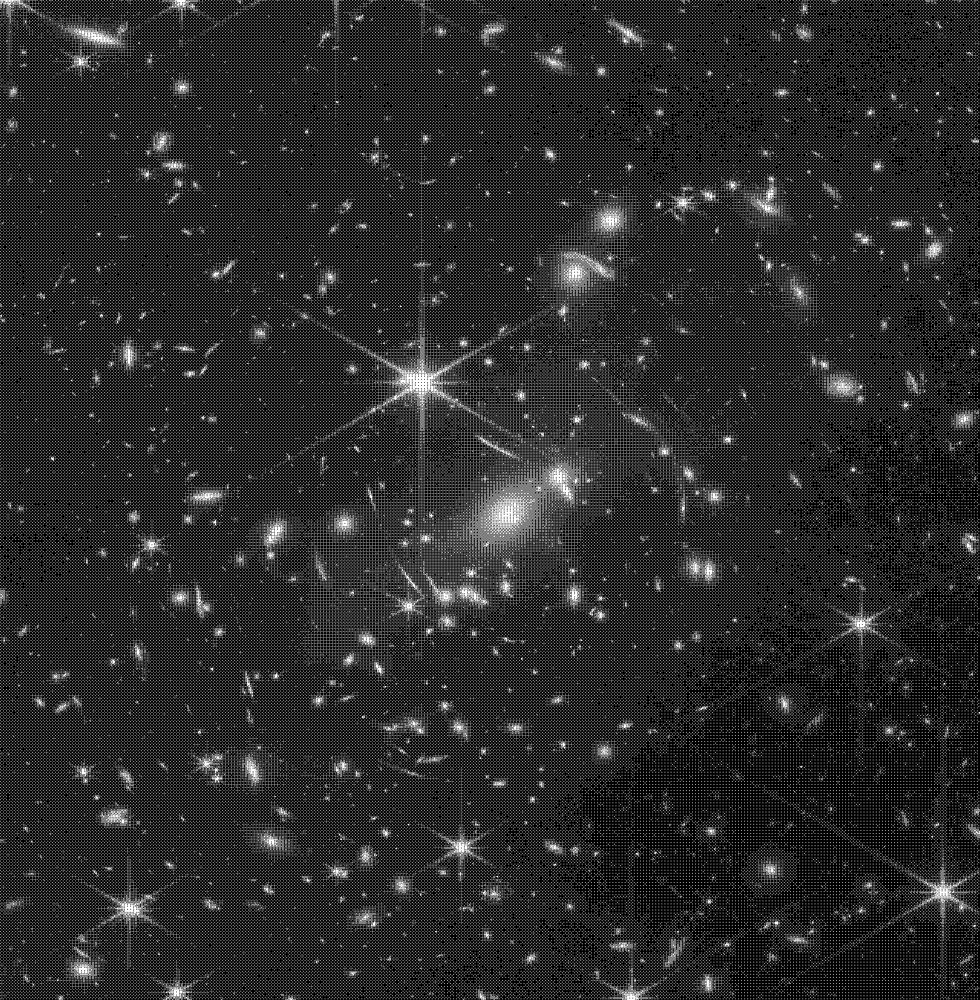
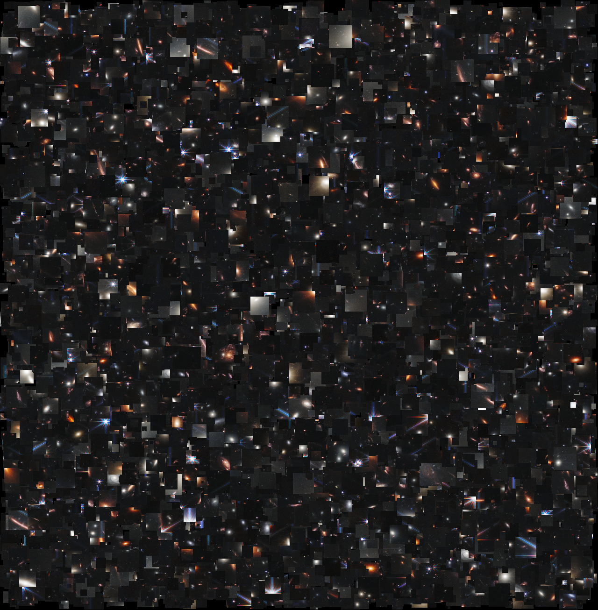

# P5.js Image Effect Roulette


An interactive web application built with P5.js that allows users to upload an image and transform it with a "roulette" of random, generative effects. Download your high-resolution creations and experiment with digital art!

---

### [✨ Live Demo ✨](https://cozisoul.github.io/p5-image-effect-roulette/)

## Image examples






## Features

*   **Image Upload:** Easily upload any image from your local machine.
*   **Effect Roulette:** Each click of the "Process" button randomly applies one of three distinct effects.
*   **Adaptive Canvas:** The display area intelligently resizes to match the aspect ratio of your uploaded image, preventing distortion.
*   **High-Resolution Output:** Effects are processed on a high-resolution version of the image, ensuring quality.
*   **Download Result:** Save your final processed artwork as a high-quality PNG file.

## The Effects

The roulette will randomly choose from one of the following three generative art effects:

### 1. 1-Bit Dithering
This effect converts the image to a 1-bit black and white representation using a Bayer matrix for ordered dithering. It creates a beautiful, retro, patterned aesthetic reminiscent of early computer graphics.

### 2. Intense VHS Glitch
Simulates a heavily distorted VHS tape. This effect is a combination of:
*   **Chromatic Aberration:** Shifting the Red and Blue color channels for a color-bleed effect.
*   **Jitter Bands:** Randomly displacing multiple horizontal slices of the image to mimic a VCR's tracking error.
*   **Scanlines:** Overlaying faint, dark horizontal lines to complete the CRT screen look.

### 3. Pixel Sampler
A chaotic collage effect. Instead of just swapping pixels, this algorithm takes thousands of random square chunks of various sizes from the source image and "pastes" them at random locations, creating a dense, textured, and abstract version of the original.

### 4. Pixel Sorting
This effect rearranges pixels in each row of the image based on their brightness. It typically creates horizontal "streaks" or "glitches," transforming the image into an abstract, often data-moshed, visual. The sorting can be based on various criteria (brightness, hue, saturation), but this implementation uses brightness.

## Built With

*   [P5.js](https://p5js.org/) - The core JavaScript library for creative coding.
*   HTML5 & CSS3

## Getting Started

To run this project on your local machine, follow these simple steps.

### Prerequisites

You need to have [Git](https://git-scm.com) installed on your computer.

### Installation

1.  Clone the repo:
    ```bash
    git clone https://github.com/your-username/your-repository-name.git
    ```
2.  Navigate to the project directory:
    ```bash
    cd your-repository-name
    ```
3.  Run the project using a local web server. The easiest way is with the [Live Server](https://marketplace.visualstudio.com/items?itemName=ritwickdey.LiveServer) extension for VS Code. Simply right-click on `index.html` and select "Open with Live Server".

## Acknowledgments
*   A big thank you to the entire P5.js community for creating and maintaining such a wonderful and accessible library for artists and developers.
